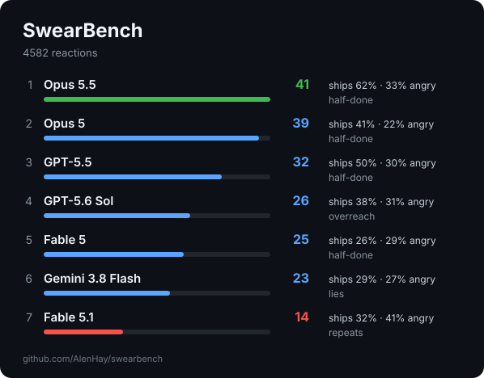

# SwearBench

**Which AI coding model made you swear the least?**

Public benchmarks measure what models can do. SwearBench measures how they made *you* feel: it reads your
own local agent logs, finds every message you sent in reaction to a model's reply, has an LLM judge label how
mad you were and why, and ranks the models.




## Run it

```sh
uvx --from git+https://github.com/AlenHay/swearbench swearbench
```

It prints a leaderboard and writes `swearbench-out/report.md`, `chart.svg` (swearing vs. result), `card.svg` and `results.json`.
Before anything leaves your machine it tells you how many messages it will send to the judge and asks.

| Flag | |
|---|---|
| `--dry-run` | show what logs were found and how many messages would be judged |
| `--judge claude-cli\|codex-cli\|anthropic\|openai\|command` | who labels your messages (default: first of `claude`, `codex`, `ANTHROPIC_API_KEY`, `OPENAI_API_KEY`) |
| `--judge-model ID` | model for the judge |
| `--judge command --judge-cmd "ollama run qwen3"` | any command that reads a prompt on stdin and prints the reply; keeps everything local |
| `--since 2026-09-01` | only recent reactions |
| `--exclude MODEL` | drop a model from the ranking |
| `--no-quotes` | leave the hall of shame out of the report |

Labels are cached in `~/.cache/swearbench/`, so re-runs only judge new messages.

## Where it looks

| Tool | Location |
|---|---|
| Claude Code | `~/.claude/projects/**/*.jsonl` |
| Codex CLI | `~/.codex/sessions/**/*.jsonl` |
| OpenCode | `~/.local/share/opencode/opencode.db` |
| T3 Code | `~/.config/t3/userdata/state*.sqlite` (used for exact per-turn model attribution when present) |

Only messages **you** typed count. Subagent transcripts, headless runs (`claude -p`, `codex exec`) and messages
the judge flags as agent-written are skipped. Models that only ever ran as subagents are listed, never ranked.

## How it scores

Every message you send is charged to the model whose reply you were answering. The judge labels it:

- **anger** 0–4, and **who it's aimed at**: the model, or something external (swearing at your cloud
  provider is not the model's fault; "this looks fucking cool" is not anger)
- **how** you got mad, weighted by how bad it is:

  | Mode | Weight | | Mode | Weight |
  |---|---|---|---|---|
  | fabrication (claimed success that wasn't) | 3 | | incomplete / lazy | 1.5 |
  | overreach (did things you didn't ask) | 3 | | insult | 1.5 |
  | giving up on it | 3 | | profanity | 1 |
  | regression (broke what worked) | 2.5 | | shouting | 0.5 |
  | ignored an instruction | 2 | | sarcasm | 0.5 |
  | made you repeat yourself | 2 | | slow / verbose | 0.5 |

- **satisfaction** −2 (rejects the work) to +2 (praise)

Rage for a message = anger + mode weights, when aimed at the model. Each interrupt adds 1.5.

The headline is half friction, half result:

```
Friction   = clean-turn % − 0.5 × rage per 100 turns + 10 × average satisfaction
Ships      = % of sessions whose last reaction accepts the work
SwearBench = (Friction + Ships) / 2
```

A clean turn is one where your next message carries no anger at the model and doesn't reject its work.
Friction alone rewards a model that is pleasant but never finishes; Ships alone ignores what it cost you
to get there. The chart plots the two against each other.

Intervals are a 90% bootstrap over sessions; models with fewer than 40 reactions aren't ranked.
With T3 Code, the report also shows the share of sessions that ended in a merged PR. It is informational
only, since T3 records PRs only from when it started tracking them.

**Per token of work.** If the logs carry token usage, the report adds a second ranking: rage per million output
tokens the model produced in sessions you drove. A model that does twice the work per message gets credit for it.
Subagent token use is shown separately.

## Caveats

- n = 1. It measures you, your tasks and your mood as much as the models. Models used in different months
  did different work; the report tells you counts, not causes.
- The judge is a model too. If it belongs to a family being ranked, SwearBench says so; re-run with another
  `--judge` and compare.
- Deleted or rotated logs mean missing data, especially for the per-token view.
- `report.md` quotes your own messages. Read it before you share it. The card and chart have no quotes.

## License

MIT
